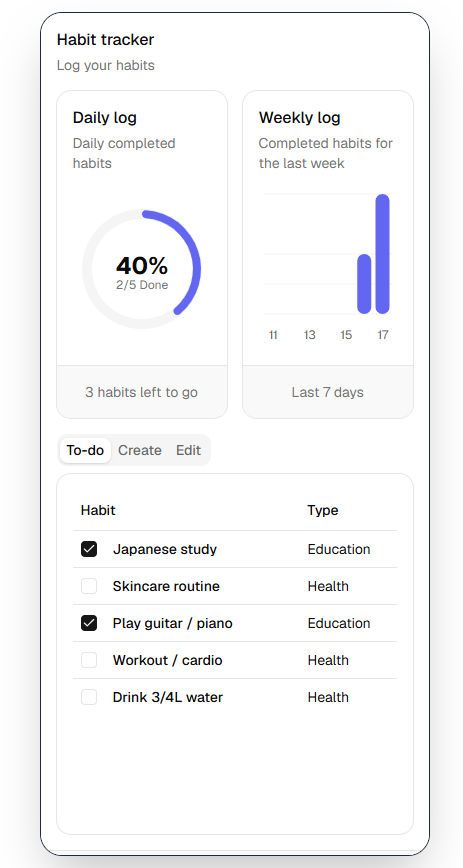

# Habit tracker app

## Overview
Habit tracker app which allows you to create and manage your
current habits. Habits can be separated by type and dynamically
update the charts depending on your daily completion status.

## Preview



## Tech Stack

* Vite
* React + TypeScript
* TailwindCSS
* shadcn + recharts

## Features

* Allows you to create and customize habits
* Allows you to check off completed habits - dynamically updating the charts
* Allows you to edit and adjust current habits
* Allows you to track your weekly progress for your habits

## Setup

Live app: [habit-tracker-vclaudio.vercel.app](https://habit-tracker-vclaudio.vercel.app)

To run locally:
```bash
git clone https://github.com/vclaudio11/habit-tracker.git
cd habit-tracker
npm install
npm run dev
```

## Roadmap

* [ ] Integrate a backend database to allow for cross-device data persistence
* [ ] Create a journal log attached to each day which can be stored with other logs
* [ ] Allow users to filter habits based off their type
* [ ] Allow users to create custom habit types for a more personalized experience
