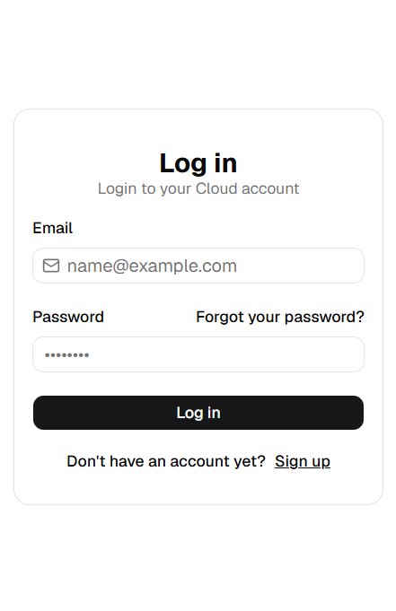
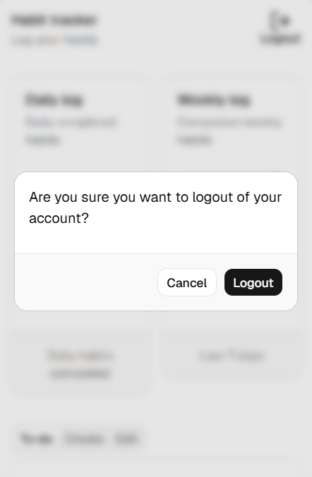
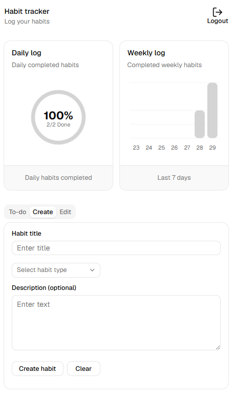

# Cloud - Habit Tracker

## Overview
A full stack habit tracker that allows you to create, manage
and track your daily habits across any device. Built with a 
React frontend and a Node.js/Express backend, using per-user
data isolation through JWT authentication

## Preview

<div align="center">
  
  
  
</div>

## Tech Stack
### Frontend
* Vite
* React + TypeScript
* TailwindCSS
* shadcn + recharts
* Framer motion

### Backend
* Node.js + Express
* PostgreSQL
* JWT (jsonwebtoken) authentication
* bcrypt - password hashing
* CORS

### Deployment
* Frontend - Vercel
* Backend + Database - Railway

## Features
* User registration and login with JWT authentication
* Passwords hashed with bcrypt
* Per-user data isolation - each user only sees their own habits
* Create, edit, delete and check off habits
* Radial / bar chart for viewing daily and weekly habit completions
* Daily reset for habits
* Cross-device sync - data persistence using PostgreSQL
* Accessible / installable on phone home screens

## Setup

Live app: [habit-tracker-vclaudio.vercel.app](https://habit-tracker-vclaudio.vercel.app)

To run locally you need both the frontend and the backend running:

### Frontend
```bash
git clone https://github.com/vclaudio11/habit-tracker.git
cd habit-tracker
npm install
npm run dev
```

### Backend
```bash
git clone https://github.com/vclaudio11/express-server.git
cd express-server
npm install
nodemon index.js
```

Create a '.env' file in the express-server root:
DB_HOST=localhost
DB_PORT=5432
DB_NAME=habit_tracker
DB_USER=postgres
DB_PASSWORD=your_password
JWT_SECRET=your_secret

## Roadmap
* [x] Integrate a backend database for cross-device persistence
* [ ] Create a journal log attached to each day
* [ ] Allow users to filter habits by type
* [ ] Allow users to create custom habit types
* [ ] Push notifications for daily habit reminders
